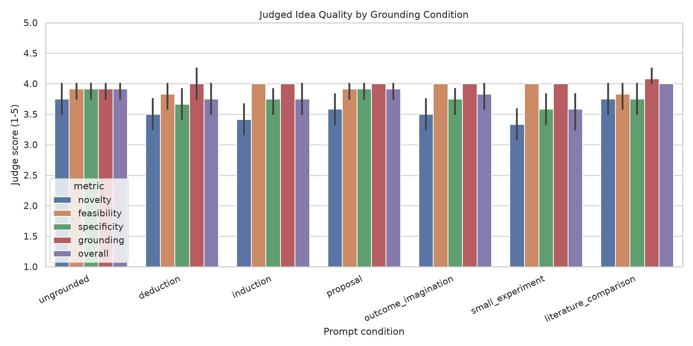
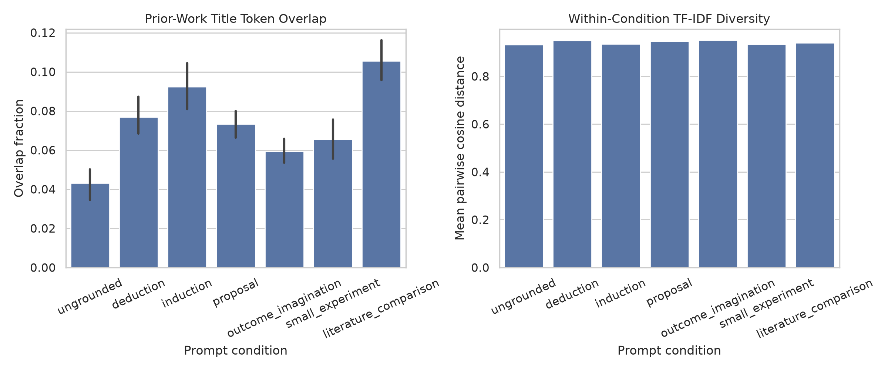
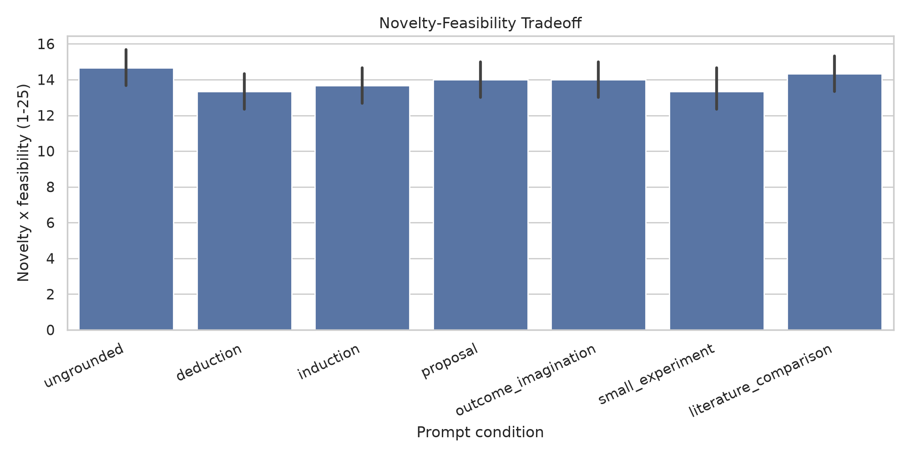

# Scientific Idea Generation with Grounded Novelty

## 1. Executive Summary

This study tested whether LLM-generated scientific ideas improve when novelty is grounded through deduction, induction, proposal writing, outcome imagination, a small empirical audit, or explicit literature comparison rather than an ungrounded novelty prompt. Using 12 AI Idea Bench 2025 contexts, `openai/gpt-4.1-mini` generated 84 ideas across 7 matched prompt conditions, and `google/gemini-2.5-flash` independently judged each idea on novelty, feasibility, specificity, grounding, risk awareness, and overall quality.

The main result is mixed-to-negative for the hypothesis as operationalized here. Literature comparison had the highest mean overall score (4.00 vs. 3.92 for ungrounded), but no judged quality metric showed a statistically significant condition effect; the ungrounded baseline had the best novelty-feasibility product. Grounded prompts significantly increased lexical overlap with prior-work titles, suggesting that simple grounding can make ideas more visibly literature-connected while also pulling them closer to the retrieved literature.

Practical implication: prompt-level grounding alone is not enough. If the goal is better scientific ideation, grounding needs stronger mechanisms such as retrieval quality control, explicit anti-copying constraints, candidate diversification, human calibration, and actual execution feedback.

## 2. Research Question & Motivation

**Research question:** Can LLMs generate better scientific ideas when novelty is grounded through concrete operations or evidence rather than an abstract request for novelty?

The motivation comes from recent scientific ideation work showing that LLM ideas can appear novel but may be less feasible, less diverse, or weak after execution. The literature review identified a gap: many systems use grounding, but fewer studies isolate different grounding operations under identical topics, model, and evaluation criteria.

## 3. Experimental Setup

### Models and API

- Generation model: `openai/gpt-4.1-mini` via OpenRouter chat completions.
- Judge model: `google/gemini-2.5-flash` via OpenRouter chat completions.
- Generation temperature: 0.7.
- Judge temperature: 0.0.
- Random seed: 42.
- Raw prompts and responses: `results/model_outputs/generations.jsonl` and `results/model_outputs/evaluations.jsonl`.
- Prompt templates and sampled contexts: `results/prompt_templates.json` and `results/contexts.json`.

### Data

Primary generation contexts came from local AI Idea Bench 2025 metadata:

- File: `datasets/ai_idea_bench_2025/test.parquet`.
- Sample: 12 contexts selected with seed 42.
- Inputs exposed to the generator: broad revised topic, keywords, and top prior-work titles where appropriate.
- Hidden from the generator: target paper name, target method, target motivation, and target summary.

RINoBench and AI-Researcher review data informed the rubric but were not direct benchmark targets for generated ideas.

### Prompt Conditions

Each context received one generated idea under each condition:

- `ungrounded`: topic and keywords only.
- `deduction`: infer a gap from topic, keywords, and prior-work titles.
- `induction`: infer a trend from prior-work titles and propose the next step.
- `proposal`: write the idea as a compact proposal with method, data, baselines, metrics, and ablations.
- `outcome_imagination`: imagine positive and negative outcomes before finalizing the idea.
- `small_experiment`: use a real lexical metadata audit over prior-work titles.
- `literature_comparison`: compare against each prior-work title and revise to differentiate.

### Metrics

The judge scored each idea from 1 to 5 on novelty, feasibility, specificity, grounding, risk awareness, and overall quality. Derived metrics included:

- `quality_mean`: mean of novelty, feasibility, specificity, grounding, and overall.
- `novelty_feasibility_product`: novelty x feasibility, range 1-25.
- `prior_overlap_fraction`: fraction of generated content terms overlapping prior-work title terms.
- `condition_diversity`: mean pairwise TF-IDF cosine distance among ideas in a condition.

### Statistical Plan

Because every context was evaluated under every condition, tests were paired by context. The analysis used Friedman omnibus tests across all conditions and Wilcoxon signed-rank tests for each grounded condition versus `ungrounded`, with Holm correction. Effect sizes are paired Cohen's d. Bootstrap 95% confidence intervals were computed for condition means.

### Environment and Compute

- Python: 3.12.8.
- Key libraries: pandas 3.0.4, NumPy 2.5.0, SciPy 1.18.0, scikit-learn 1.9.0, matplotlib 3.11.0, seaborn 0.13.2.
- GPU detected: 4 x NVIDIA RTX A6000, 49,140 MiB each.
- GPU use: none. The experiment used external APIs and CPU-side analysis only.
- Batch sizes and training-time comparisons: not applicable; no model training was performed.
- Token usage: 77,047 generation tokens and 93,467 judge tokens across unique parsed records. OpenRouter returned cost metadata for judge calls only: approximately $0.0538.

## 4. Results

### Main Score Table

| Condition | n | Novelty | Feasibility | Specificity | Grounding | Overall | Novelty x Feasibility | Prior-Work Overlap |
|---|---:|---:|---:|---:|---:|---:|---:|---:|
| ungrounded | 12 | 3.75 | 3.92 | 3.92 | 3.92 | 3.92 | 14.67 | 0.043 |
| deduction | 12 | 3.50 | 3.83 | 3.67 | 4.00 | 3.75 | 13.33 | 0.077 |
| induction | 12 | 3.42 | 4.00 | 3.75 | 4.00 | 3.75 | 13.67 | 0.092 |
| proposal | 12 | 3.58 | 3.92 | 3.92 | 4.00 | 3.92 | 14.00 | 0.073 |
| outcome_imagination | 12 | 3.50 | 4.00 | 3.75 | 4.00 | 3.83 | 14.00 | 0.059 |
| small_experiment | 12 | 3.33 | 4.00 | 3.58 | 4.00 | 3.58 | 13.33 | 0.065 |
| literature_comparison | 12 | 3.75 | 3.83 | 3.75 | 4.08 | 4.00 | 14.33 | 0.106 |

### Statistical Tests

No judged quality metric showed a significant omnibus condition effect:

- Novelty: Friedman p = 0.197.
- Feasibility: Friedman p = 0.295.
- Specificity: Friedman p = 0.361.
- Overall: Friedman p = 0.157.
- Quality mean: Friedman p = 0.208.
- Novelty-feasibility product: Friedman p = 0.572.

Prior-work lexical overlap did show a strong condition effect:

- Prior-work overlap: Friedman statistic = 53.21, p = 1.06e-9.
- Every grounded condition had higher overlap than the ungrounded baseline after Holm correction.
- Literature comparison had the largest mean overlap increase over baseline (+0.063, paired d = 2.84, Holm p = 0.0029).

## 5. Analysis & Discussion

The hypothesis was not supported in the strongest sense. Grounded prompt variants did not significantly improve novelty, feasibility, specificity, overall score, or the novelty-feasibility product over the ungrounded baseline. The strongest grounded condition was literature comparison, with overall 4.00 versus 3.92 for ungrounded, but the paired difference was tiny and not statistically reliable.

The clearest measurable effect was increased prior-work overlap. This is important because it cuts both ways: grounding made ideas visibly connected to existing work, but it also increased reuse of terms from the prior-work list. For scientific ideation, this may be a failure mode: literature-aware prompts can make the model sound more situated while narrowing its conceptual search around retrieved titles.

The small empirical audit condition performed worst on judged novelty and overall quality. Its audit was intentionally lightweight, based only on title-term frequencies and missing evaluation cues. This suggests that "small experiments" only help if the experiment produces meaningful evidence rather than shallow metadata.

Error analysis showed repeated failure modes:

- Vague central mechanisms, such as "adaptive modules" or "contrastive heads" without enough implementation detail.
- Feasibility usually remained high because the model could name datasets and baselines, but this may reflect proposal fluency rather than true executable strength.
- Literature comparison often produced polished differentiation claims, but those claims did not consistently raise judged novelty.

## 6. Limitations

This is a compact pilot, not a definitive benchmark. The sample size was 12 contexts, and the judge used coarse integer scores that produced ceiling effects around 3-4. The evaluation relied on an LLM judge, not human expert review, although the judge model differed from the generator. Prior-work grounding used titles from AI Idea Bench metadata, not full paper text or citation graphs. The small-experiment condition used a real but shallow lexical audit, not full code execution of proposed ideas.

The overlap metric is lexical and cannot distinguish useful technical reuse from copying. The generated ideas were not executed, so feasibility may be overestimated. API model behavior can change over time; raw outputs and model IDs are saved for traceability, but exact reproduction depends on provider stability.

## 7. Conclusions & Next Steps

This experiment gives a cautious answer: simple prompt-level grounding did not improve scientific idea quality over an ungrounded novelty prompt in this matched pilot. Grounding mainly increased visible relation to prior work, and in some cases reduced judged novelty.

Recommended follow-up experiments:

1. Use full abstracts or paper sections with retrieval reranking rather than only titles.
2. Add an anti-copying objective that explicitly rewards conceptual distance from retrieved works.
3. Generate multiple candidates per condition and rerank for diversity before judging.
4. Calibrate judges against RINoBench or human annotations before using them for generated ideas.
5. Add actual execution-based validation for a subset of ideas, following AI Scientist or ScienceAgentBench-style workflows.

## Output Files

- Plan: `planning.md`.
- Experiment runner: `src/run_grounded_ideation_experiment.py`.
- Analysis script: `src/analyze_grounded_ideation.py`.
- Raw generations: `results/model_outputs/generations.jsonl`.
- Raw evaluations: `results/model_outputs/evaluations.jsonl`.
- Contexts: `results/contexts.json`.
- Environment: `results/environment.json`.
- Score table: `results/tables/idea_level_scores.csv`.
- Condition summary: `results/tables/condition_summary.csv`.
- Statistical tests: `results/tables/omnibus_tests.csv`, `results/tables/pairwise_tests_vs_ungrounded.csv`.
- Error analysis: `results/evaluations/error_analysis.md`.
- Figures: `figures/condition_scores.png`, `figures/overlap_diversity.png`, `figures/novelty_feasibility_product.png`.

## References

- Wang, Downey, Ji, and Hope. SciMON: Scientific Inspiration Machines Optimized for Novelty. https://arxiv.org/abs/2305.14259
- Si, Yang, and Hashimoto. Can LLMs Generate Novel Research Ideas? https://arxiv.org/abs/2409.04109
- Baek, Jauhar, Cucerzan, and Hwang. ResearchAgent. https://arxiv.org/abs/2404.07738
- Li et al. Chain of Ideas. https://arxiv.org/abs/2410.13185
- Shahid et al. Literature-Grounded Novelty Assessment of Scientific Ideas. https://arxiv.org/abs/2506.22026
- Schopf and Farber. RINoBench. https://arxiv.org/abs/2603.10303
- Guo et al. IdeaBench. https://arxiv.org/abs/2411.02429
- Qiu et al. AI Idea Bench 2025. https://arxiv.org/abs/2504.14191
- Lu et al. The AI Scientist. https://arxiv.org/abs/2408.06292
- OpenRouter API documentation. https://openrouter.ai/docs/api/reference/overview
